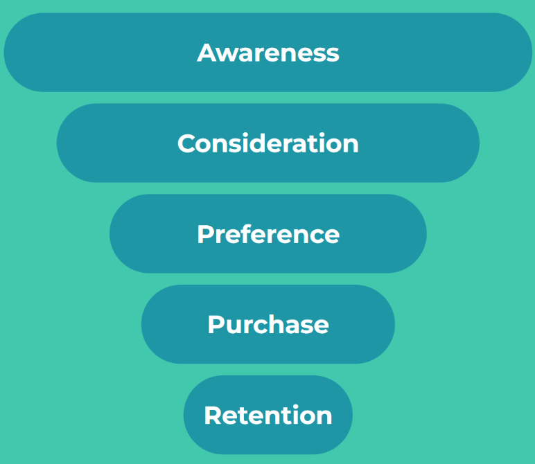

# Measuring the long-term impact of media?

For Brands, measuring long-term marketing effects is a challenge. It is important that brand marketing, more focused on driving long-term growth or category growth, is fairly captured. 

The popularity of digital tracking approaches (such as last click attribution) has made it even more difficult to value longer-term or brand-focused events. These approaches focus on the short term and attributing credit/ value to the channel closest to the purchase. 

That's where approaches focused on incrementality become even more important. Let's have a look at two ways to capture the long-term impact.  

## A Nested modelling structure:

When identifying the KPIs to analyse it is important to ensure that you are analysing the drivers across the purchase pathway. In addition, when your marketing is focused on driving awareness or consideration metrics, it is important that this is measured as a KPI. 

Secondly, to test the long-term impact at Linea, we would recommend using a nesting model structure. This focuses on measuring KPIs across the pathway, for example, measuring what drives Awareness and then how this change in awareness drives purchase (e.g. Sales or New Customers). This type of structure allows the analysis to capture how changes in awareness drive sales over the long term.

## How else do we capture the long-term impact?

We also use the adstock or memory effect. This measures how a marketing investment drives purchase not just today but tomorrow, the day after and so on.  

In this example, adstock can be seen impacting *Sales*. This captures how the impact of *Media Spend* lasts for a period of time after the marketing spend has taken place. Use the slider to see how the impact of media can change depending on the percentage of impact retained each week. 

The MMM analysis dynamically tests for this impact allowing for the comparison of the time to impact for each marketing channel e.g. demonstrating for your marketing activity does social media have a longer memory impact than TV?
