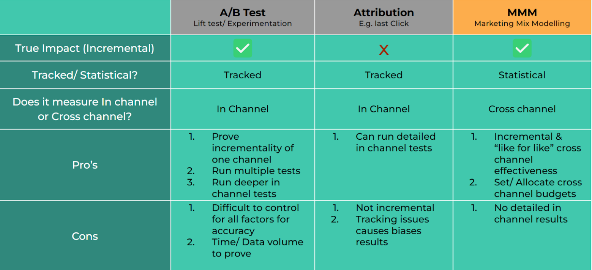

# **What is Marketing Mix Modeling (MMM)** 

Marketing Mix Modeling (MMM) is a technique used by businesses to measure the effectiveness of different marketing channels and strategies. 

The goal is to isolate the impact of all factors in driving business performance. This allows the separation of marketing factors separate to seasonal, economic & other drivers. This allows us to compare the impact from the analysis with the spend invested in marketing to calculate Return on Investment (ROI). 

In addition we can test the impact of different spend levels & compare marketing strategies/ channels to allow for the optimization of future marketing efforts.

**How does MMM fit alongside other marketing measurement approaches?**

MMM is focused on the incremental impact of marketing. Unlike other methodologies that may overlook external factors, MMM takes a more holistic view by accounting for key drivers of business performance beyond just media spend. Each statistical analysis will be built bespoke for your brand and includes elements like seasonality, economic conditions, competitor activity, price changes, and consumer trends. 

By isolating these variables, MMM provides a clearer understanding of the true impact that marketing efforts have on business outcomes. The below table shows how this fits alongside other measurement techniques

### **Why Use MMM?**

The primary purpose of MMM is to understand what drives business results—sales, store visits, website traffic—and to determine the contribution of different marketing tactics. Whether it’s television advertising, social media campaigns, or digital ads, MMM enables marketers to identify which channels or campaigns deliver the best ROI. With this information, they can test hypothesis or optimize budgets to maximize returns on future campaigns.

A key strength of MMM is its ability to provide insights while controlling for external factors to allow for optimising future budgets. This allows marketers to avoid overestimating or underestimating the contribution of media by factoring in variables such as economic trends, competitor actions, and seasonal fluctuations. This is an area where other methodologies, like Multi-Touch Attribution (MTA), can fall short, often failing to account for these broader market influences.
